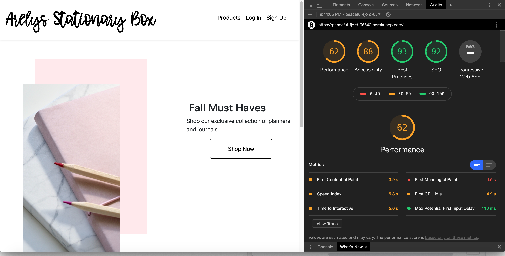
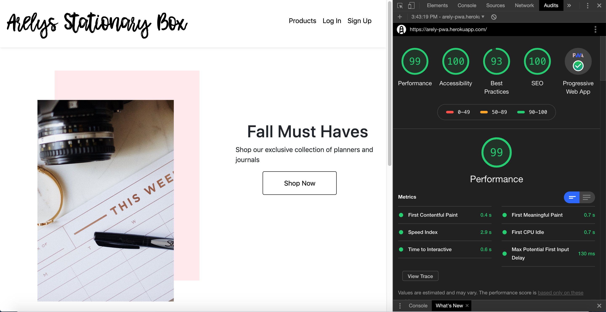
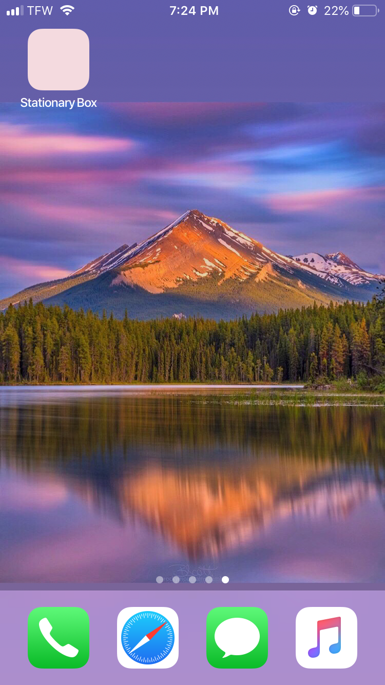

# React PWA (Progressive Web App)

This is an assignment which required a React App to be transformed into a Progressive Web App. 
You can find a version of it on [Heroku](arely-pwa.herokuapp.com).

## App Screenshots

These are Lighthouse Audits before and after PWA refactoring:





These are screenshots of the project on mobile:




## Installation

Install dependencies
```sh
npm install
```

## Usage

The database of this app is run in MongoDB Atlas. You will have to create a .env file in the root of the directory and append your own MongoDB URL and a Secret for your JWT Token. For example:
```sh
ATLAS_URI = mongodb://my-mongodb-url
SECRET = mysupersecretsecret
```

Run development server
```sh
npm run start
```

## About
This app was built using React, MongoDB, Node.js and the Express web framework
